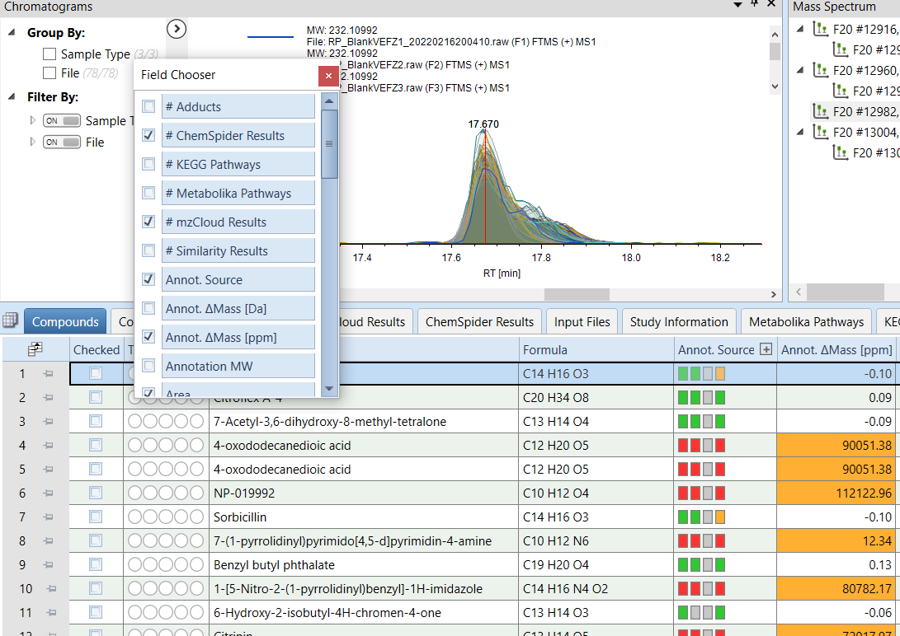
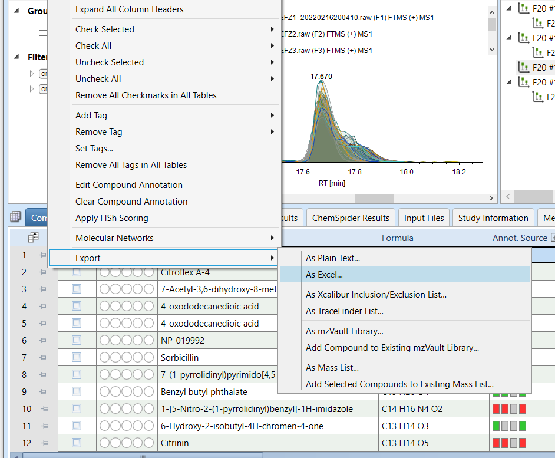
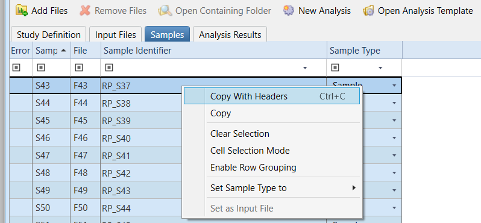
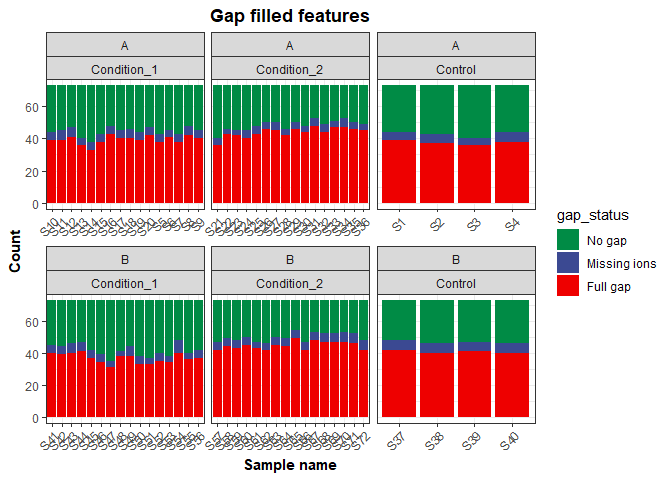
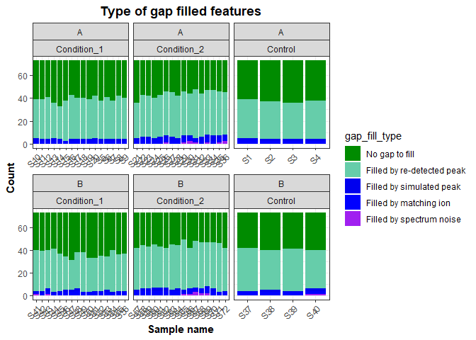
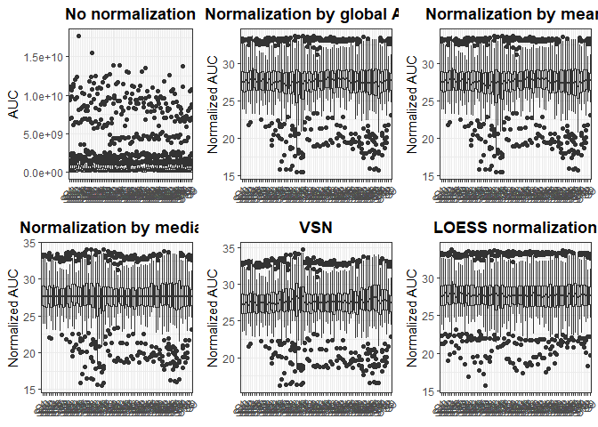
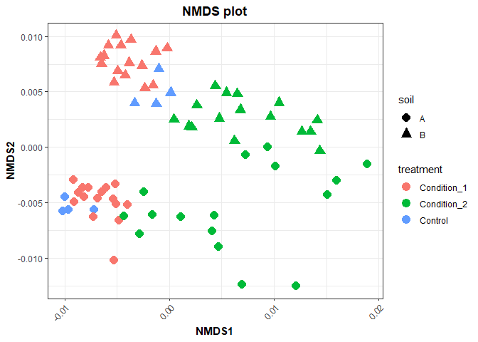

Tutorial for the analysis of LC-MS/MS feature abundance and annotation
data
================
Christian Ayala

# Introduction

This repository intendts to serve as a guide on how to analyze Feature
abundance and annotation data generated with the **Compound Discoverer**
software. The idea is to expand and customize the analysis and figures
that can be generated directly with Compound Discoverer to allow for
more detailed or in-depth analysis of the data. All the code and data
mentioned in this tutorial can be found in the file
`c_disc_analysis.Rmd` of this repository.

# Exporting data from Compound Discoverer

In the **Compounds** tab of Compound Discoverer results visualization
select the following *Field* to export:

-   Annot. $\Delta$Mass \[ppm\]
-   Area
-   Calc. MW
-   Formula
-   Gap Status
-   Gap Fill Status
-   MS2
-   Name
-   RT \[min\]

Then, right-click on the headers and select `Export -> As Excel`

<p align="center">


</p>

Save the exported data in the `inputs` directory.

# Creating a metadata file

A metadata file with information about the samples (i.e., treatment,
experimental conditions) is needed for the analysis. This file can be
created by selecting and copying all rows of the **Sample information**
table in the **Samples** tab of the Compound Discoverer *Study* files
(see picture below), or can be created manually.

<p align="center">

</p>

# Analyzing data with RStudio

This repository can be clone to quickly download the R MarkDown script
(`c_disc_analysis.Rmd`), the custom functions and the tutorial data.

    git clone https://github.com/Coayala/c_discoverer_data_analysis_tutorial.git

It is good practice to create an individual `R project` for each data
set that is going to be analyzed. Creating and `R project` which also
allow the library `here` used in this tutorial to work properly for path
set up.

## 1. Load libraries

To analyze the data generated by Compound Discoverer the following
libraries are needed

``` r
library(tidyverse)
library(readxl)
library(ggpubr)
library(ggsci)
library(vegan)
library(rstatix)
library(factoextra)
library(ComplexHeatmap)
library(here)
```

## 2. Load custom functions

The following files provide a set of custom functions to quickly analyze
the data

``` r
source('custom_functions/functions_cdis_exploration.R')
source('custom_functions/functions_cdis_norm_stats.R')
source('custom_functions/functions_cdis_diff.R')
```

## 3. Setting up

In this section we will set up variables that will be sued throughout
the script. This includes create directories to contain the outputs
(i.e., figures and tables) that will be generated with this script.

**Setting up directory paths**

``` r
# Main results folder
project_dir <- here('cd_tutorial_results')

# Figures output directory
figures_dir <- here(project_dir, 'figures')

# Tables output directory
tables_dir <- here(project_dir, 'tables')
```

**Creating directories**

To create the directories use the function `walk` to repeat the same
function over a list of variables. Throughout this script the iteration
functions from the `purrr` package (e.g., `map` and `walk`) will be
used. To learn more about iterations using `purrr` please check
[here](https://r4ds.had.co.nz/iteration.html#the-map-functions)

``` r
dirs <- c(project_dir, figures_dir, tables_dir)
walk(dirs, function(x){
  if(!dir.exists(x)) dir.create(x)
})
```

**Creating a theme**

A object with theme options that will be used for all of th figures will
be created to avoid repeating lines of code.

``` r
my_theme <- theme_bw() +
  theme(plot.title = element_text(face = 'bold', hjust = 0.5),
        axis.title = element_text(face = 'bold', hjust = 0.5),
        axis.text.x = element_text(angle = 45, hjust = 1))
```

## 4. Load data

**Opening and rearranging the exported feature data table.**

In this step a unique identifier (`FeatureID`) will be assigned to each
detected peak. Additionally, the annotation of compounds with and error
of $|Annot. \Delta Mass| > 5$ will be eliminated. If data was already
manually curated comment out the first `mutate` call.

``` r
cd_results_table <- read_xlsx(here('inputs', 'feature_data.xlsx')) %>%
  # Removing annotations of peaks with high ppm errors
  mutate(Name = ifelse(abs(`Annot. DeltaMass [ppm]`) > 5, NA, Name),
         Formula = ifelse(abs(`Annot. DeltaMass [ppm]`) > 5, NA, Formula)) %>% 
  arrange(desc(`Calc. MW`)) %>% 
  mutate(FeatureID = paste0('Feature',formatC(n():0001, 
                                              width = 4, 
                                              flag = '0'))) %>%
  select(FeatureID, Name, Formula, `Calc. MW`, 
         contains('Annotation source'), contains('Results'), 
         contains('Pathways'), 
         contains('Area:'), 
         contains('Gap Status:'),
         contains('Gap Fill Status:')) %>%
  # Differentiate between features that share the same name using "peak#" at the end of the name
  group_by(Name) %>% 
  add_count(Name) %>% 
  # Create variable with names for plotting (useful in following scripts)
  mutate(name4plot = case_when(is.na(Name) ~ FeatureID,
                               n == 1 ~ Name,
                               TRUE ~  paste0(Name, '-peak', n():1))) %>% 
  select(-n) %>% 
  ungroup()
```

**Opening metadata file**

``` r
metadata <- read_csv(here('inputs', 'metadata.csv'))
```

    ## Rows: 72 Columns: 4
    ## ── Column specification ────────────────────────────────────────────────────────
    ## Delimiter: ","
    ## chr (4): SampleID, soil, treatment, time
    ## 
    ## ℹ Use `spec()` to retrieve the full column specification for this data.
    ## ℹ Specify the column types or set `show_col_types = FALSE` to quiet this message.

## 5. Checking the data

### 5.1 Number of gap filled features

Check how many of the features were gap-filled to determine if the
parameters on Compound Discoverer were good, or if they need to be
changed.

**Number of gap filled features per sample**

Calculating the number of gap filled features based on the Gap Status
columns from C. Discoverer results

``` r
gap_status <- cd_results_table %>% 
  select(FeatureID, contains('Gap Status:')) %>% 
  pivot_longer(contains('Gap Status:'), names_to = 'SampleID', values_to = 'gap_status') %>% 
  mutate(SampleID = str_remove(SampleID, 'Gap Status: '),
         SampleID = str_remove(SampleID, '.raw.*'),
         gap_status = factor(gap_status, levels = c('No gap', 'Missing ions', 'Full gap'))) 
```

To plot the result, first we count how many times each *gap status*
appears per sample.

``` r
gap_status_plot <- gap_status %>% 
  group_by(SampleID) %>% 
  count(gap_status) %>% 
  left_join(metadata, by = 'SampleID') %>% 
  ggplot() +
  geom_col(aes(x = SampleID,
               y = n,
               fill = gap_status)) +
  facet_wrap(~ soil + treatment, scales = 'free_x') +
  scale_fill_manual(values = c('#008B45FF', '#3B4992FF', '#EE0000FF')) +
  labs(x = 'Sample name',
       y = 'Count',
       title = 'Gap filled features') +
  my_theme

gap_status_plot
```

<!-- -->

**Gap filling methods per sample**

If more detailed information about how data was gap filled we can use
the Gap Fill Status columns from C. Discoverer. The type of gap filling
was obtained by comparing the numbers in the Excel file, to the
information that appear when hovering over C. Discoverer results.

``` r
gap_fill_status <- cd_results_table%>% 
  select(FeatureID, Name, contains('Gap Fill Status:')) %>% 
  pivot_longer(contains('Gap Fill Status:'), names_to = 'SampleID', values_to = 'gap_fill') %>% 
  mutate(SampleID = str_remove(SampleID, 'Gap Fill Status: '),
         SampleID = str_remove(SampleID, '.raw.*')) %>% 
  mutate(gap_fill_type = case_when(gap_fill == 32 ~ 'Filled by spectrum noise',
                                   gap_fill == 128 ~ 'Filled by re-detected peak',
                                   gap_fill == 0 ~ 'No gap to fill',
                                   gap_fill == 16 ~ 'Filled by simulated peak',
                                   gap_fill == 8 ~ 'Filled by trace area',
                                   gap_fill == 64 ~ 'Filled by matching ion')) %>% 
  mutate(gap_fill_type = factor(gap_fill_type, 
                                levels = c('No gap to fill', 'Filled by re-detected peak', 
                                           'Filled by simulated peak', 'Filled by matching ion',
                                           'Filled by trace area', 'Filled by spectrum noise')))
```

Plotting the results

``` r
gap_summary_plot <-  gap_fill_status %>% 
  select(SampleID, gap_fill_type) %>% 
  group_by(SampleID) %>% 
  count(gap_fill_type) %>% 
  left_join(metadata, by = 'SampleID') %>% 
   ggplot() +
  geom_col(aes(x = SampleID,
               y = n,
               fill = gap_fill_type)) +
  facet_wrap(~ soil + treatment, scales = 'free_x') +
  scale_fill_manual(values = c('green4', 'aquamarine3', 'blue2', 'blue', 'purple', 'firebrick2')) +
  labs(x = 'Sample name',
       y = 'Count',
       title = 'Type of gap filled features') +
  my_theme
  

gap_summary_plot
```

<!-- -->

## 6. Rearranging data

### 6.2 Calculate Biochemical Indexes

The custom functions in the `functions_cdis_exploration.R` file are used
to rearrange the data and calculate biochemical indexes (useful to
compare samples when there is not enough annotation). The biochemical
indexes are calculated with the same formulas used in
[MetaboDirect](https://metabodirect.readthedocs.io/en/latest/pipeline.html#data-pre-processing).

``` r
# Split formula column into elemental counts
cd_results_table <- separate_formula(cd_results_table) %>% 
  # Calculate ratios and thermodynamic indices
  calc_ratios_n_idxs(.)
```

    ## Joining, by = c("FeatureID", "Formula")
    ## Joining, by = c("FeatureID", "Formula")
    ## Joining, by = c("FeatureID", "Formula")
    ## Joining, by = c("FeatureID", "Formula")
    ## Joining, by = c("FeatureID", "Formula")
    ## Joining, by = c("FeatureID", "Formula")

### 6.3 Calculate putative molecular classes

Compounds can be classified in putative molecular classes based on their
molecular formula. This not a completely accurate classification for
LC-MS/MS data, if you InChIKeys or InCHI for your features please use
[Classyfire](https://cfb.fiehnlab.ucdavis.edu/) instead.

``` r
cd_results_table <- calc_classes(cd_results_table)
```

### 6.4 Extracting area under the curve (AUC) data

``` r
compounds_table <- cd_results_table %>% 
    select(-contains('Gap Status:'), -contains('Labeling Status:'), -contains('Gap Fill Status:')) %>% 
    pivot_longer(contains('Area:'), names_to = 'SampleID', values_to = 'AUC') %>% 
    mutate(SampleID = str_remove(SampleID, 'Area: '),
           SampleID = str_remove(SampleID, '.raw.*')) %>% 
    left_join(metadata, by = 'SampleID')

auc_matrix <- compounds_table %>% 
    select(FeatureID, SampleID, AUC) %>% 
    pivot_wider(names_from = 'SampleID', values_from = 'AUC') %>% 
    column_to_rownames(var = 'FeatureID')
```

## 7. Statistical Analysis

### 7.1 Normalizing data

Several data normalization methods can be applied. To test a few of them
we can use custom functions

``` r
normalize_by_all(auc_matrix)
```

<!-- -->

The best normalization method appears to be `LOESS normalization`. That
is the one that will be used for the next steps

``` r
norm_matrix <- cycloess.norm(auc_matrix)
```

### 7.2 Multivariate analysis

#### NMDS

NMDS is an ordination method that can use different distance matrices to
cluster the data. For this particular dataset, since we have relative
abundances we are using `bray_curtis` distances.

**Calculating distance matrix**

``` r
# distance matrix by Bray because relative abundance mode was selected
dm <- t(norm_matrix) %>% 
  vegdist(., method = 'bray')
```

**Performing NMDS analysis**

``` r
nmds_res <- metaMDS(dm,
          k = 2,
          maxit = 999,
          trymax = 500,
          wascores = TRUE)
```

    ## Run 0 stress 0.1220264 
    ## Run 1 stress 0.1220264 
    ## ... Procrustes: rmse 1.610821e-05  max resid 0.0001115948 
    ## ... Similar to previous best
    ## Run 2 stress 0.1222021 
    ## ... Procrustes: rmse 0.008394484  max resid 0.05146383 
    ## Run 3 stress 0.2464701 
    ## Run 4 stress 0.1219992 
    ## ... New best solution
    ## ... Procrustes: rmse 0.006516641  max resid 0.05233997 
    ## Run 5 stress 0.1219992 
    ## ... Procrustes: rmse 1.134487e-05  max resid 8.358761e-05 
    ## ... Similar to previous best
    ## Run 6 stress 0.1220264 
    ## ... Procrustes: rmse 0.00651646  max resid 0.05230921 
    ## Run 7 stress 0.1222021 
    ## ... Procrustes: rmse 0.005683796  max resid 0.04497399 
    ## Run 8 stress 0.1221682 
    ## ... Procrustes: rmse 0.009325697  max resid 0.05263667 
    ## Run 9 stress 0.1222021 
    ## ... Procrustes: rmse 0.005676546  max resid 0.04491296 
    ## Run 10 stress 0.1221628 
    ## ... Procrustes: rmse 0.009024195  max resid 0.05247348 
    ## Run 11 stress 0.1221682 
    ## ... Procrustes: rmse 0.009307805  max resid 0.05263368 
    ## Run 12 stress 0.2500392 
    ## Run 13 stress 0.1221682 
    ## ... Procrustes: rmse 0.009324797  max resid 0.05263568 
    ## Run 14 stress 0.1220264 
    ## ... Procrustes: rmse 0.006515991  max resid 0.05231059 
    ## Run 15 stress 0.1221682 
    ## ... Procrustes: rmse 0.009312747  max resid 0.05263706 
    ## Run 16 stress 0.1221628 
    ## ... Procrustes: rmse 0.009035963  max resid 0.05247377 
    ## Run 17 stress 0.1220264 
    ## ... Procrustes: rmse 0.006515852  max resid 0.05230882 
    ## Run 18 stress 0.1222022 
    ## ... Procrustes: rmse 0.005612371  max resid 0.04437781 
    ## Run 19 stress 0.1220264 
    ## ... Procrustes: rmse 0.006515756  max resid 0.0523089 
    ## Run 20 stress 0.1220264 
    ## ... Procrustes: rmse 0.006516421  max resid 0.0523094 
    ## *** Solution reached

**Extracting NMDS scores and plotting**

``` r
nmds_scores <- as.data.frame(scores(nmds_res, display = 'sites')) %>%
    rownames_to_column(var = 'SampleID') %>% 
    left_join(metadata, by = 'SampleID')


nmds_plot <- nmds_scores %>% 
    ggplot() +
    geom_point(aes(x = NMDS1,
                   y = NMDS2,
                   color = treatment,
                   shape = soil),
               size = 4) +
    labs(title = 'NMDS plot') +
    my_theme

nmds_plot
```

<!-- -->
