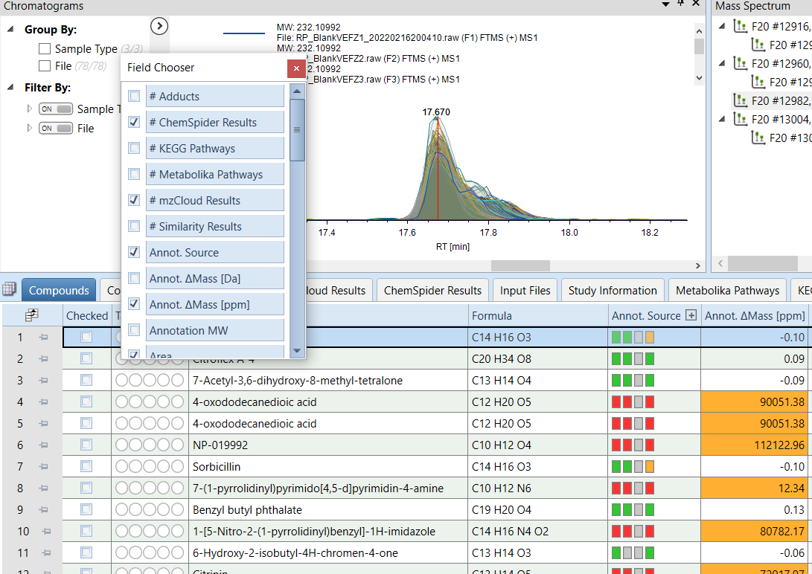
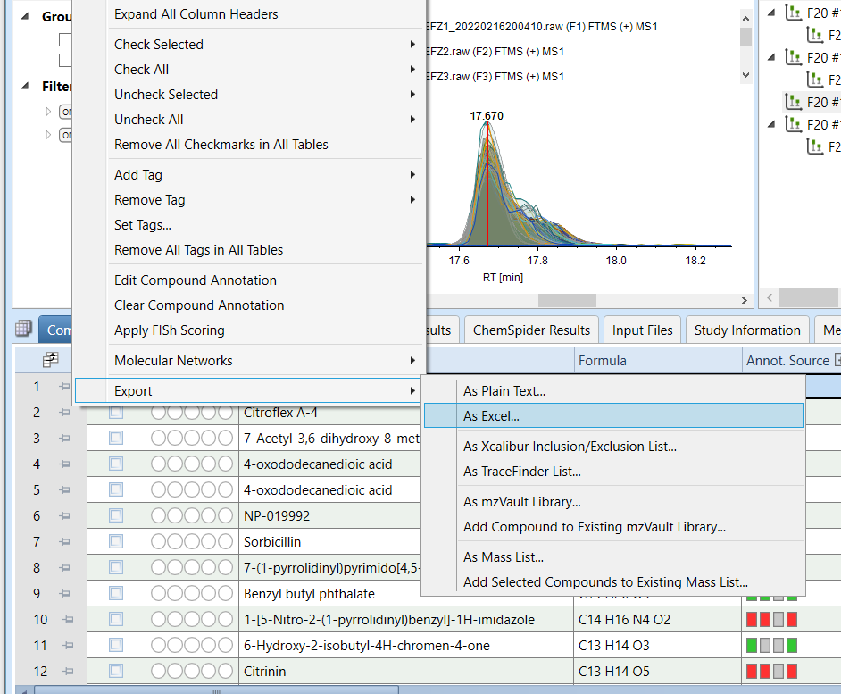

# Introduction

This repository intendts to serve as a guide on how to analyze Feature abundance and annotation data generated with the **Compound Discoverer** software. The idea is to expand and customize the analysis and figures that can be generated directly with Compound Discoverer to allow for more detailed or in-depth analysis of the data. All the code mentioned in this tutorial can be found in the file `c_disc_analysis.Rmd` of this repository.

# 1. Exporting data from Compound Discoverer

In the **Compounds** tab of Compound Discoverer results visualization select the following *Field* to export:

- Annot. $\Delta$Mass [ppm]
- Area
- Calc. MW
- Formula
- Gap Status
- Gap Fill Status
- MS2
- Name
- RT [min]

Then, right-click on the headers and select `Export -> As Excel`

<p align="center">
  
  
</p>

# 2. Analyzing data with RStudio

This repository can be clone to quickly download the R MarkDown script (`c_disc_analysis.Rmd`), the custom functions and the tutorial data.

```
git clone https://github.com/Coayala/c_discoverer_data_analysis_tutorial.git
```

It is good practice to create an individual `R project` for each dataset that is going to be analyzed

## 2.1 Load libraries

To analyze the data generated by Compound Discoverer the following libraries are needed

```{r}
library(tidyverse)
library(readxl)
library(ggpubr)
library(vegan)
library(rstatix)
library(factoextra)
library(ComplexHeatmap)
```

## 2.2 Load custom functions

The following files provide a set of custom functions to quickly analyze the data

```{r}
source('custom_functions/functions_cdis_exploration.R')
source('custom_functions/functions_cdis_norm_stats.R')
source('custom_functions/functions_cdis_diff.R')
```


