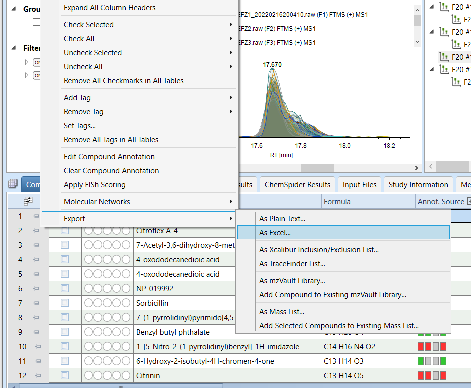

Tutorial for the analysis of LC-MS/MS feature abundance and annotation
data
================
Christian Ayala

# Introduction

This repository intendts to serve as a guide on how to analyze Feature
abundance and annotation data generated with the **Compound Discoverer**
software. The idea is to expand and customize the analysis and figures
that can be generated directly with Compound Discoverer to allow for
more detailed or in-depth analysis of the data. All the code mentioned
in this tutorial can be found in the file `c_disc_analysis.Rmd` of this
repository.

# 1. Exporting data from Compound Discoverer

In the **Compounds** tab of Compound Discoverer results visualization
select the following *Field* to export:

-   Annot. $\Delta$Mass \[ppm\]
-   Area
-   Calc. MW
-   Formula
-   Gap Status
-   Gap Fill Status
-   MS2
-   Name
-   RT \[min\]

Then, right-click on the headers and select `Export -> As Excel`

<p align="center">


</p>

# 2. Analyzing data with RStudio

This repository can be clone to quickly download the R MarkDown script
(`c_disc_analysis.Rmd`), the custom functions and the tutorial data.

    git clone https://github.com/Coayala/c_discoverer_data_analysis_tutorial.git

It is good practice to create an individual `R project` for each dataset
that is going to be analyzed

## 2.1 Load libraries

To analyze the data generated by Compound Discoverer the following
libraries are needed

``` r
library(tidyverse)
```

    ## ── Attaching packages ─────────────────────────────────────── tidyverse 1.3.2 ──
    ## ✔ ggplot2 3.3.6     ✔ purrr   0.3.4
    ## ✔ tibble  3.1.8     ✔ dplyr   1.0.9
    ## ✔ tidyr   1.2.0     ✔ stringr 1.4.0
    ## ✔ readr   2.1.2     ✔ forcats 0.5.1
    ## ── Conflicts ────────────────────────────────────────── tidyverse_conflicts() ──
    ## ✖ dplyr::filter() masks stats::filter()
    ## ✖ dplyr::lag()    masks stats::lag()

``` r
library(readxl)
library(ggpubr)
library(vegan)
```

    ## Loading required package: permute
    ## Loading required package: lattice
    ## This is vegan 2.6-2

``` r
library(rstatix)
```

    ## 
    ## Attaching package: 'rstatix'
    ## 
    ## The following object is masked from 'package:stats':
    ## 
    ##     filter

``` r
library(factoextra)
```

    ## Welcome! Want to learn more? See two factoextra-related books at https://goo.gl/ve3WBa

``` r
library(ComplexHeatmap)
```

    ## Loading required package: grid
    ## ========================================
    ## ComplexHeatmap version 2.13.2
    ## Bioconductor page: http://bioconductor.org/packages/ComplexHeatmap/
    ## Github page: https://github.com/jokergoo/ComplexHeatmap
    ## Documentation: http://jokergoo.github.io/ComplexHeatmap-reference
    ## 
    ## If you use it in published research, please cite either one:
    ## - Gu, Z. Complex heatmaps reveal patterns and correlations in multidimensional 
    ##     genomic data. Bioinformatics 2016.
    ## - Gu, Z. Complex Heatmap Visualization. iMeta 2022.
    ## 
    ## 
    ## The new InteractiveComplexHeatmap package can directly export static 
    ## complex heatmaps into an interactive Shiny app with zero effort. Have a try!
    ## 
    ## This message can be suppressed by:
    ##   suppressPackageStartupMessages(library(ComplexHeatmap))
    ## ========================================

## 2.2 Load custom functions

The following files provide a set of custom functions to quickly analyze
the data

``` r
source('custom_functions/functions_cdis_exploration.R')
source('custom_functions/functions_cdis_norm_stats.R')
source('custom_functions/functions_cdis_diff.R')
```
